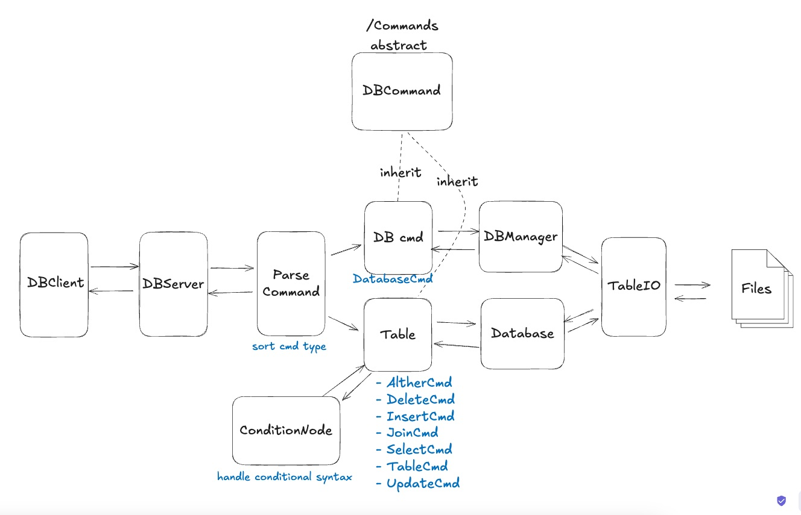

## To start the database server:

mvn exec:java -Dexec.mainClass="edu.uob.DBServer"
mvn exec:java@server
`Server listening on port 8888`

## rebust your server (NOT WORKING)

1. (mac) brew install watchexec
2. watchexec -w src --clear -- mvn exec:java@server

## To start the database client:

mvn exec:java -Dexec.mainClass="edu.uob.DBClient"
mvn exec:java@client

## Database

mvn exec:java -Dexec.mainClass="edu.uob.Database"

# java-cw-db

### Structure

